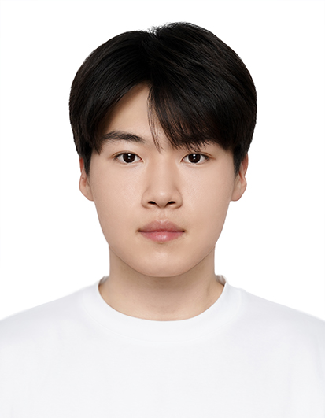

## Biography

<a href="https://www.linkedin.com/in/jiwookum">Jiwoo Kum</a> is a master's student in the School of <a href="https://sw.ssu.ac.kr/">Software</a> at Soongsil University. He is currently conducting research at the <a href="https://sites.google.com/view/ssu-nlp/home">Natural Language Processing Lab</a>. His research interests include natural language processing (NLP) and large language models (LLMs), with a particular focus on understanding and analyzing the internal mechanisms and behaviors of LLMs. His current research explores the interpretability and analysis of large language models. For more details, please see his <a href="./Jiwoo_Kum_CV.pdf?v=9683815">CV</a>.

## Research Interests

* Large Language Models (LLMs)
* LLM Interpretability
* Small Language Models (SLMs)
* Knowledge Distillation

## Education

* **2026.03 - 2028.08 (Expected)**: M.S. in <a href="https://sw.ssu.ac.kr/">Software</a>, Soongsil University (Advisor: <a href="https://parkchanjun.github.io/">Prof. Chanjun Park</a>) 
* **2021.03 - 2027.02 (Expected)**: B.S. in <a href="https://sw.ssu.ac.kr/">Software</a>, Soongsil University (Advisor: <a href="https://parkchanjun.github.io/">Prof. Chanjun Park</a>) 

## Work Experiences

* **2025.11 - Now**: <a href="https://sites.google.com/view/ssu-nlp/home">Natural Language Processing Lab</a>, Soongsil University, Research Assistant  

## Additional Links

* <a href="https://creator40937.tistory.com/">Blog Link</a>.
* <a href="https://scholar.google.com/citations?user=ywx-3wgAAAAJ&hl=ko">Google Scholar</a>.
